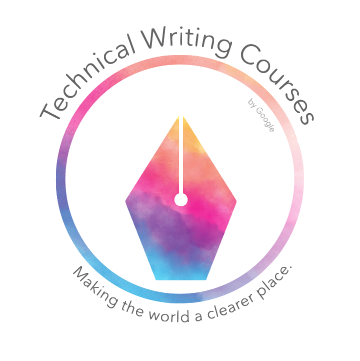

# 技术写作课程

每一位工程师都有另一个身份：作家。

这套课程与学习资源旨在帮你提升技术文档的写作能力，学会如何策划和写作技术文档。你还可以了解到在 Google，技术作者是怎样一个角色。

[**Get started**](https://jiekun.github.io/tech-writing/)

> 译者注：本套写作指南翻译自 Google 的 [Technical Writing Courses](https://developers.google.com/tech-writing)，在此推荐有兴趣的同学参与到原课程的更多内容中去。Google 除了本套 Courses 外，还有大量技术创作、技术分享的课程。

---

